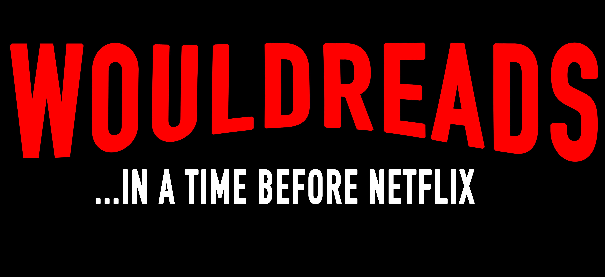

<!-- [![Live Link][live-link-shield]][live-link-url]
[![LinkedIn][linkedin-shield]][linkedin-url] -->

  

  

# About The Project
WouldReads is a clone of GoodReads.com with a Netflix style. The JavaScript application uses Pug for the frontend and Express for the backend.

[live-link-shield]: https://img.shields.io/badge/-LiveLink-red?style=for-the-badge&logo=red
[live-link-url]: https://wouldreadz.herokuapp.com/

[linkedin-shield]: https://img.shields.io/badge/-LinkedIn-red.svg?style=for-the-badge&logo=linkedin&colorB=red
[linkedin-url]: https://www.linkedin.com/in/andrea-jackson1/
